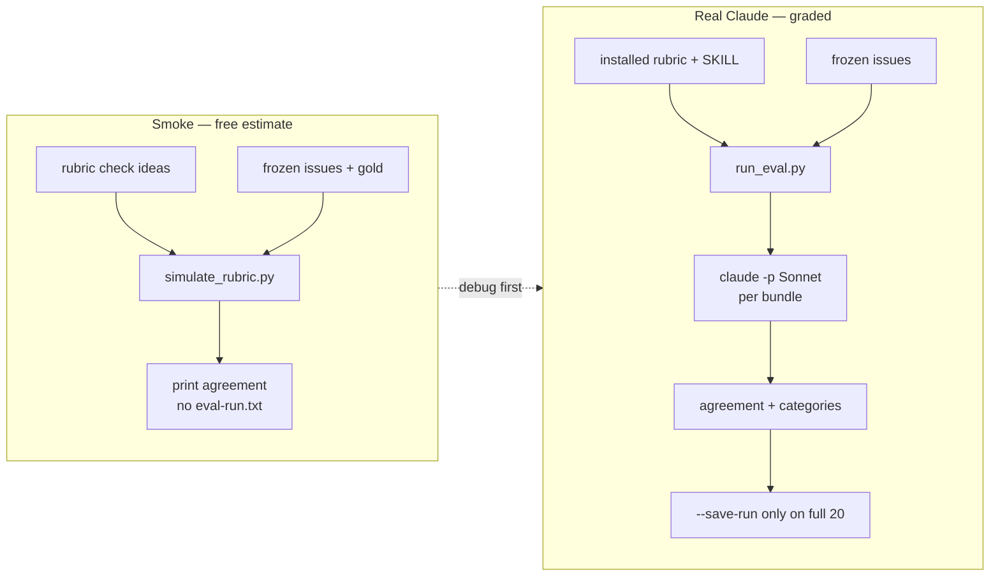
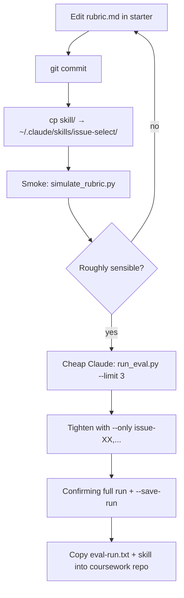

# Smoke eval vs real Claude eval (Unit 1)

Where this sits: notes under `beat-1-sandbox/unit-1/` in
[`speculaas/ai301-coursework-trilogy-preview`](https://github.com/speculaas/ai301-coursework-trilogy-preview).
The runnable starter lives beside your notes at
`../unit-01/ai301-unit1-starter/` (local zimmnotes layout).

## One-line difference

| | **Smoke** (`simulate_rubric.py`) | **Real / graded** (`run_eval.py`) |
|---|---|---|
| Who grades? | Local Python heuristics | Claude Code CLI (`claude -p`, Sonnet) |
| Cost | Free | Course credit (~$0.20/`--only`, ~$4 full) |
| Writes `eval-run.txt`? | **No** | **Yes**, only with full run + `--save-run` |
| Counts for portal? | **No** (debug only) | **Yes** (harness fingerprint) |
| Reads your `rubric.md`? | Approximates check *ideas* | Sends full skill + rubric + bundle to Sonnet |

Smoke answers: “Do my check *ideas* roughly track gold?”  
Real answers: “Does **Sonnet executing my written rubric** hit the bar (≥18/20 + category floor)?”

GitHub Mermaid does not layout two separate ```mermaid blocks truly “side by side.”
Put **both flows in one diagram** as two subgraphs on a left–right (`LR`) chart
(or use an HTML `<table>` with one diagram per cell — often stripped/ugly in GitHub).



On GitHub: open the file view (not raw) so Mermaid renders. In the editor preview, confirm both subgraphs appear left/right.

## Recommended loop



### Commands (after skill install)

```bash
# 0) sync install from starter (edit→commit→copy)
cp -R /path/to/ai301-unit1-starter/skill/. ~/.claude/skills/issue-select/

# 1) smoke (from starter eval/)
cd /path/to/ai301-unit1-starter/eval
python3 simulate_rubric.py

# 2) real — cheap first
python3 run_eval.py --rubric ~/.claude/skills/issue-select/rubric.md --limit 3

# 3) real — fix disagreements only
python3 run_eval.py --rubric ~/.claude/skills/issue-select/rubric.md --only issue-10,issue-15,issue-20

# 4) real — confirming full run for submission
python3 run_eval.py --rubric ~/.claude/skills/issue-select/rubric.md \
  --save-run /path/to/ai301-coursework/beat-1-sandbox/unit-1/eval-run.txt
```

Partial `--limit` / `--only` runs **refuse** to write `eval-run.txt`. Do not hand-edit that file.

## What smoke cannot catch

Sonnet may interpret borderline scope/policy wording differently than the Python heuristics. Recent smoke on this machine was **17/20**, with misses on scope-style gold rejects (`issue-10`, `issue-15`, `issue-20`). Treat that as “tighten `scope-fits-newcomer` before burning a full $4 run,” not as a ship grade.

## Related files

- Smoke how-to: `ai301-unit1-starter/eval/README-simulate-rubric-offline.md`
- Official harness: `ai301-unit1-starter/eval/README.md`
- Unit 1 checklist: `2026-09-21-unit1-step-by-step.md` (same folder)

## Does smoke reflect Claude faithfully?

**No — estimate only, not a faithful replay.**

| | Smoke | Claude harness |
|---|---|---|
| Judge | Fixed Python heuristics | Sonnet reading your prose rubric |
| Same verdict always? | Yes (deterministic) | Usually stable, not bit-identical |
| Borderline scope/policy | Often under-rejects | May pass/fail differently |
| Submission artifact | None | Fingerprinted `eval-run.txt` |

Use smoke to catch **obvious** dead-repo / claimed / archived misses before spending credit. Do **not** treat 17/20 smoke as “I’ll get 17 on Sonnet.”

## Conserving Claude while aiming for a passable score (≥18/20 + category floor)

1. **Re-copy** starter `skill/` → `~/.claude/skills/issue-select/` so live/eval use the filled rubric + real `scope.md` Repo/fit.
2. **Tighten only what smoke already flags** — recently `issue-10`, `issue-15`, `issue-20` (all **scope** gold-rejects that smoke wrongly accepted). In `scope-fits-newcomer`, explicitly fail:
   - self-described mega/tracking lists
   - long design debates / abandoned-PR archaeology with no settled spec
   - one-line feature wishes / product calls with no acceptance criteria
3. **Spend credit in this order** (cheapest → dearest):
   - `run_eval.py … --limit 3` once (sanity)
   - `… --only issue-10,issue-15,issue-20` after each scope tweak (~$0.20 each)
   - optional `--only` on any new disagreements
   - **one** full run with `--save-run` when you believe you’re ≥18/20
4. **Avoid** repeated full 20-issue runs while iterating wording.
5. Keep Path Review app LLM on mock; don’t burn a second budget exploring the app.

Passable ≠ perfect: the bar is **18/20** with every category represented — stop when the confirming full run clears that, then write `selection.md`.
