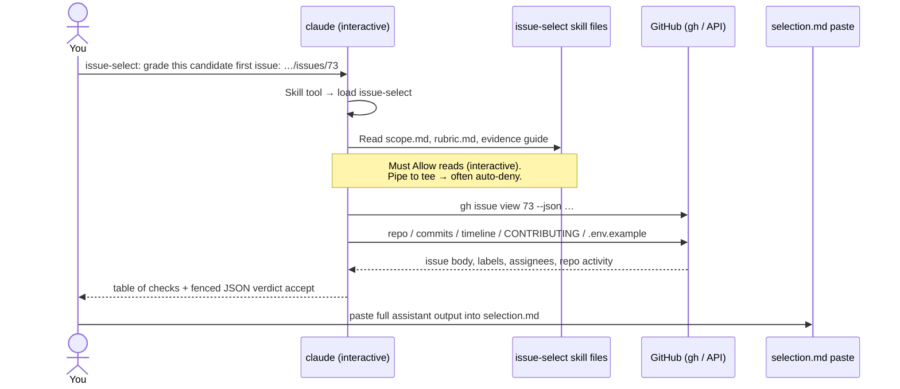
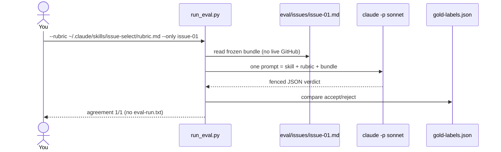

# Live `issue-select` vs eval harness (`run_eval.py`)

Companion to [`2026-09-22-run-eval-only-issue-01-sequence.md`](./2026-09-22-run-eval-only-issue-01-sequence.md).

That note covers the **cheap eval recheck** (`--only issue-01` → `claude -p`).
This one contrasts it with the **interactive live grade** of Path Review #73,
reconstructed from Claude Code session JSONL:

`~/.claude/projects/-Users-watney-git-zimmnotes-chat-codepath-ai301-beat-1-sandbox-unit-01/b8970ca5-3b37-4eed-9fc3-f8cb948e3fa1.jsonl`

Accept backup: [`live-transcript-issue-73-accept.txt`](./live-transcript-issue-73-accept.txt).

## Side-by-side

| | Eval harness (`run_eval.py`) | Live select (interactive `claude`) |
|---|---|---|
| Trigger | `python3 run_eval.py … --only issue-01` | `claude` REPL or `claude "issue-select: …"` |
| Claude invocation | Non-interactive `claude -p --model sonnet` via subprocess | Interactive session (tool Allow prompts) |
| Evidence | Frozen `eval/issues/issue-01.md` only | Live GitHub via `gh` / API / raw files |
| Skill load | Harness pastes skill + rubric into one prompt | `Skill` tool + `Read` on `scope.md` / `rubric.md` / evidence guide |
| Output you keep | Agreement table; full 20 + `--save-run` → `eval-run.txt` | Terminal / JSONL transcript → paste into `selection.md` |
| Writes `eval-run.txt`? | Only on a full `--save-run` | Never |
| Failure mode we hit | False reject when rubric over-tight | `| tee` / non-interactive → skill read denied |

## Mermaid — live #73 path (what the JSONL shows)

## Mermaid — eval `--only` path (summary; detail in sibling note)

## Takeaway for Unit 1 packaging

- Use **eval** to iterate the rubric cheaply and produce `eval-run.txt`.
- Use **live** once (interactive, no `| tee` until permissions are allowed) to produce the `selection.md` verdict paste.
- Same skill files; different evidence channels. Do not mix their failure stories in one diagram.
