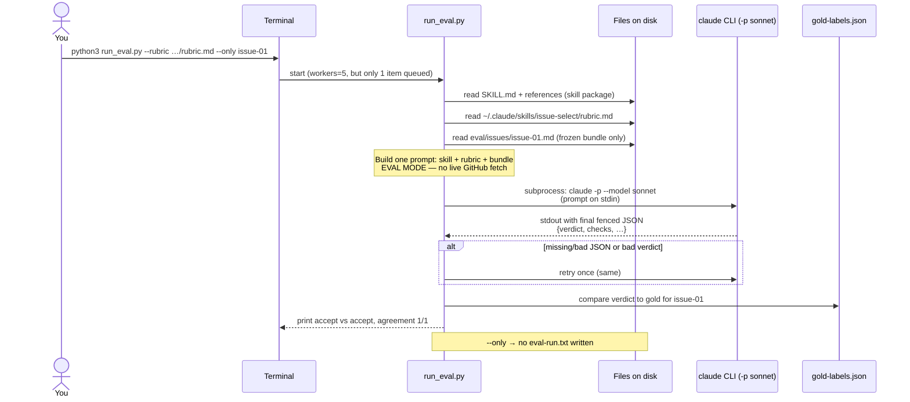

# What `run_eval.py --only issue-01` did (and yes, it calls the Claude CLI)

## Your result (2026-09-22)

```text
python3 run_eval.py --rubric ~/.claude/skills/issue-select/rubric.md --only issue-01
grading 1 bundle(s) with rubric.md, model sonnet, 5 worker(s)...
  issue-01: accept

item      gold    verdict  agree  note
issue-01  accept  accept   yes

agreement: 1/1 scored items
```

**Meaning:** After loosening `scope-fits-newcomer` for coherent multi-file docs,
Sonnet **accepted** the gold-accept docs task. This cheap recheck (~one Sonnet
call) confirmed the earlier `--limit 3` false reject is fixed for `issue-01`.

This is **not** a full submission run: `--only` / `--limit` runs **do not** write
a valid `eval-run.txt`. Only a complete 20-issue run with `--save-run` does.

## Does it call the Claude CLI?

**Yes.** `run_eval.py` shells out to:

```bash
claude -p --model sonnet
```

via `subprocess.run`, once per bundle (with one retry on bad/missing JSON).
It does **not** grade locally. Free `simulate_rubric.py` never calls `claude`.

Pinned in harness: `MODEL = "sonnet"`.

## Sequence (what happened for `--only issue-01`)



## Data flow inside that one Claude call

1. Harness loads your **installed** rubric path (not a mystery copy).
2. Prompt tells Claude: run **issue-select** in **eval mode**; evidence = bundle text only.
3. Claude applies each rubric check, returns JSON with `verdict: accept|reject`.
4. Harness parses the **last** ```json``` block, scores against gold, prints the table.

## Next (still conserve credit)

Optional: `--only issue-10,issue-15,issue-20` to guard scope rejects.  
Then **one** full run with `--save-run` when ready (and after any late-submit confirmation with staff).

## Related: live select vs this harness path

Live Path Review grading (interactive Claude + `gh`, session `b8970ca5…`) is a
**different** sequence than `--only`. See
[`2026-09-22-live-select-vs-eval-harness.md`](./2026-09-22-live-select-vs-eval-harness.md)
for a companion Mermaid contrast and the #73 JSONL-derived flow.
