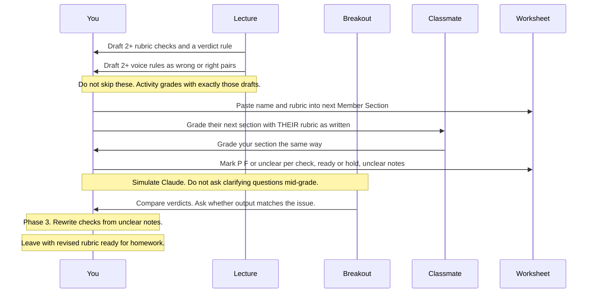
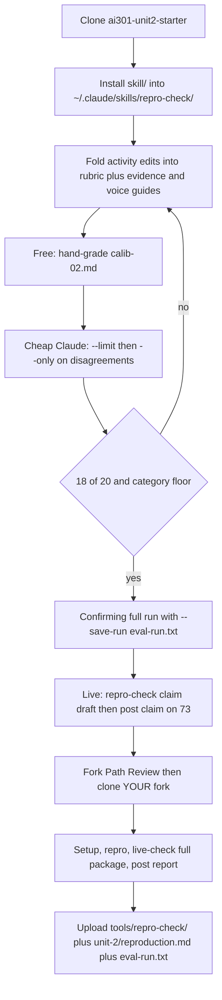

# Unit 2 session prep — Reproduce It / repro-check

Where this sits: notes under `beat-1-sandbox/unit-2/` in
[`speculaas/ai301-coursework-trilogy-preview`](https://github.com/speculaas/ai301-coursework-trilogy-preview).

Source: LMS Overview / Activity / Assignment dump at
`/Users/watney/git/zimmnotes/chat/codepath/ai301/beat-1-sandbox/unit-02/Overview-Activity-Assignment.txt`,
plus the L2 session dump `AI301-L2-Fa26-S1.txt` in this folder.

Starter clone (local):
`/Users/watney/git/zimmnotes/chat/codepath/ai301/beat-1-sandbox/unit-02/ai301-unit2-starter`
(`codepath/ai301-unit2-starter`).

## Timing

| | When (America/Denver) |
|---|---|
| **Live session** | Wed Sep 23, 2026 · 4:00 PM MDT |
| **Project 2 due** | Mon Sep 28, 2026 · 12:59 AM MDT |

Tomorrow is the **live session**, not the homework deadline. Leave class with a
draft rubric + voice rules that survived the swap. Homework (claim → fork →
repro → calibrate `repro-check`) comes after.

Chosen issue from Unit 1:
[#73](https://github.com/codepath/pathreview-ai301-fa26-s1/issues/73)
(README vs `.env.example` disagreement on the LLM provider env var —
`OPENROUTER_API_KEY` vs documented `mock`/`openai` + `OPENAI_API_KEY`). Not on
the house-issue track.

## What Unit 2 actually is

Two tracks in parallel:

1. **Human upstream:** claim #73 in your own words → fork Path Review → setup
   from repo docs → faithful repro (or honest cannot-repro) → post the report.
2. **Skill:** finish three judgment files inside `~/.claude/skills/repro-check/`
   — `rubric.md`, `references/evidence-guide.md`, `voice-guide.md` — then hit
   ≥18/20 on the harness (category floor matters; one disclosure-wall package
   cannot be papered over by volume).

Unit 1 withheld only the rubric. This week you write **three** files. Live
skill checks drafts before you post. Eval mode grades with rubric + evidence
guide only; the voice guide is live-only.

## Sequence — tomorrow's session (rubric swap)



Activity focus package: `eval/packages/calib-03.md` (in the starter).
Early finish: `calib-04.md`, or install the skill (Assignment step 1).

## Sequence — homework end-to-end (after class)



Assignment order (skim): steps 1–3 build/calibrate the skill; 4–6 use it on
the real issue; 7 submits. Claim **before** reproduce: promise the report, do
not assert a fix. Path Review house rules live in the skill's `scope.md`
(classmate claim does not block you; no piggyback "same as above").

### Install + eval commands (verified from starter)

```bash
# one canonical install (edit here; point harness at the same files)
cp -R skill/. ~/.claude/skills/repro-check/

cd eval
# free warm-up: open packages/calib-02.md and grade by hand

# cheap Claude smoke (still costs Sonnet; no local simulate script exists)
python3 run_eval.py \
  --rubric ~/.claude/skills/repro-check/rubric.md \
  --evidence ~/.claude/skills/repro-check/references/evidence-guide.md \
  --limit 3

# revise loop on disagreements only (~$0.20/pkg)
python3 run_eval.py \
  --rubric ~/.claude/skills/repro-check/rubric.md \
  --evidence ~/.claude/skills/repro-check/references/evidence-guide.md \
  --only pkg-07,pkg-12

# after loosening a check: add canaries (esp. disclosure) and/or calib with
# --include-calibration so a flip shows up before the confirming full run

# confirming full run for submit (only this writes eval-run.txt)
python3 run_eval.py \
  --rubric ~/.claude/skills/repro-check/rubric.md \
  --evidence ~/.claude/skills/repro-check/references/evidence-guide.md \
  --save-run eval-run.txt
```

## Token savings — verified against the starter (2026-09-23)

| Move | Cost | Unit 2 analogue |
|---|---|---|
| Hand-grade `calib-01`…`calib-04` | Free | Activity on `calib-03`; homework warm-up on `calib-02`; early-finish `calib-04` |
| Local Python smoke / `simulate_*.py` | n/a | **None in this starter.** `eval/` has `run_eval.py` + packages only. Every harness call uses Sonnet. |
| `--limit N` | ~$0.20 × N | Cheap Claude smoke after rubric + evidence are filled |
| `--only pkg-07,pkg-12` | ~$0.20 / package | Revise loop; compose with `--include-calibration` for calib canaries |
| Confirming full + `--save-run eval-run.txt` | ~$4 | Once, when you believe the three files |
| Live skill on drafts | Cheap vs re-posting | Required before claim and before repro comment |
| Canary on `--only` after loosening a check | Cheap insurance | Especially the 1-package `disclosure` category |

Same discipline as Unit 1 smoke → cheap Claude → confirming full, except Unit 2
has **no free simulator**. Tomorrow can stay at $0 with human `calib-*` grading;
install + `--limit` wait until after class.

Extra Unit 2 trap: `--limit` / `--only` runs **never** write `eval-run.txt`.
Never hand-edit that file. Full confirming run + `--save-run` only. Pass bar is
18/20 **and** the category floor (must match at least once in every category).

See also Unit 1 companion:
[`../unit-1/2026-09-21-smoke-vs-claude-eval.md`](../unit-1/2026-09-21-smoke-vs-claude-eval.md).

## Light checklist for 4 PM

1. Draft **two rubric checks + a ready/hold verdict rule** and **two voice
   rules** during lecture (they feed the activity).
2. Know #73 specifics for a later claim that **promises** a report, not a fix.
3. After class: install from the local starter into
   `~/.claude/skills/repro-check/`, then cheap `--limit` only after rubric +
   evidence are filled.
4. Do **not** claim upstream until live `repro-check` accepts the draft
   (Assignment step 4). Claiming is Unit 2 homework.

## What not to confuse

- **Tomorrow session** = draft + rubric swap practice (ungraded, huge head start).
- **Homework** = skill + eval + real claim/repro on #73, due Mon 9/28.
- **Submit portal** = whole `ai301-coursework` repo root URL, with
  `tools/repro-check/` + `beat-1-sandbox/unit-2/` filled (not a folder URL).

## Points (short)

Assignment worth 25: skill 8, eval run + write-up 10, posted comments 7.
Eval bar to aim at is 18/20 with category match; 18 itself scores no points —
the 10 eval points are the harness-written complete run (3) plus four
`reproduction.md` iteration fields (7). Comment points want a specific claim
and a stranger-rerunnable repro (honest cannot-repro is full credit).
