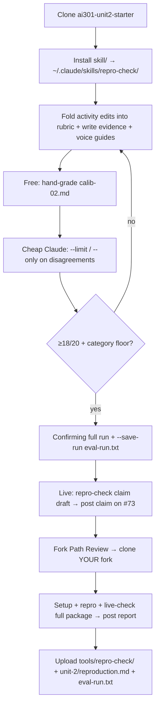

# Unit 2 session prep — Reproduce It / repro-check

Where this sits: notes under `beat-1-sandbox/unit-2/` in
[`speculaas/ai301-coursework-trilogy-preview`](https://github.com/speculaas/ai301-coursework-trilogy-preview).

Source: LMS Overview / Activity / Assignment dump at
`/Users/watney/git/zimmnotes/chat/codepath/ai301/beat-1-sandbox/unit-02/Overview-Activity-Assignment.txt`,
plus the L2 session dump `AI301-L2-Fa26-S1.txt` in this folder.

## Timing

| | When (America/Denver) |
|---|---|
| **Live session** | Wed Sep 23, 2026 · 4:00 PM MDT |
| **Project 2 due** | Mon Sep 28, 2026 · 12:59 AM MDT |

Tomorrow is the **live session**, not the homework deadline. Leave class with a
draft rubric + voice rules that survived the swap. Homework (claim → fork →
repro → calibrate `repro-check`) comes after.

Chosen issue from Unit 1:
[#73](https://github.com/codepath/pathreview-ai301-fa26-s1/issues/73)
(README vs `.env.example` disagreement on the LLM provider env var —
`OPENROUTER_API_KEY` vs documented `mock`/`openai` + `OPENAI_API_KEY`). Not on
the house-issue track.

## What Unit 2 actually is

Two tracks in parallel:

1. **Human upstream:** claim #73 in your own words → fork Path Review → setup
   from repo docs → faithful repro (or honest cannot-repro) → post the report.
2. **Skill:** finish three judgment files inside `~/.claude/skills/repro-check/`
   — `rubric.md`, `references/evidence-guide.md`, `voice-guide.md` — then hit
   ≥18/20 on the harness (category floor matters; one disclosure-wall package
   cannot be papered over by volume).

Unit 1 withheld only the rubric. This week you write **three** files. Live
skill checks drafts before you post.

## Sequence — tomorrow's session (rubric swap)

```mermaid
sequenceDiagram
  participant You
  participant Lecture
  participant Breakout
  participant Classmate
  participant Worksheet

  Lecture->>You: Draft ≥2 rubric checks + verdict rule
  Lecture->>You: Draft ≥2 voice rules (wrong/right pairs)
  Note over You,Lecture: Do not skip these — activity grades with exactly those drafts

  You->>Worksheet: Paste name + rubric into next Member Section
  You->>Classmate: Grade their next section with THEIR rubric as written
  Classmate->>You: Grade your section the same way
  You->>Worksheet: P/F/? per check, ready/hold, unclear notes
  Note over You,Breakout: Simulate Claude — do not ask clarifying questions mid-grade

  Breakout->>You: Compare verdicts; ask does output match the issue?
  You->>You: Phase 3 — rewrite checks from unclear notes
  You->>You: Leave with revised rubric ready for homework
```

Activity focus package: `eval/packages/calib-03.md` (from Unit 2 materials).
Early finish: `calib-04.md`, or install the skill (Assignment step 1).

## Sequence — homework end-to-end (after class)



Assignment order (skim): steps 1–3 build/calibrate the skill; 4–6 use it on
the real issue; 7 submits. Claim **before** reproduce: promise the report, do
not assert a fix. Path Review house rules live in the skill's `scope.md`
(classmate claim does not block you; no piggyback "same as above").

## Token savings — same shape as Unit 1 (with one caveat)

| Move | Cost | Unit 2 analogue |
|---|---|---|
| Hand-grade calibration packages | Free | Activity on `calib-03`; homework warm-up on `calib-02`; early-finish `calib-04` |
| Smoke / local simulate | Free if present | **Unknown until starter is cloned** — Unit 1 had `simulate_rubric.py`; Assignment text does not promise one for Unit 2 |
| `--limit` / `--only pkg-…` | ~$0.20 / package | Explicit this week; revise loop should not burn full runs |
| Confirming full + `--save-run` | ~$4 | Once, when you believe the three files |
| Live skill on drafts | Cheap vs re-posting | Required before claim and before repro comment |
| Canary on `--only` after loosening a check | Cheap insurance | New this week — add one package per single-package category your loosen could flip |

Same discipline as Unit 1 smoke → cheap Claude → confirming full, but the free
"smoke" for tomorrow is mostly **human grading of `calib-*`**, not a guaranteed
Python simulator. After cloning `codepath/ai301-unit2-starter`, check `eval/`
for a simulate script; if it exists, use it first.

Extra Unit 2 trap: partial `--limit` / `--only` runs **never** write
`eval-run.txt`. Never hand-edit that file. Full confirming run + `--save-run`
only.

See also Unit 1 companion:
[`../unit-1/2026-09-21-smoke-vs-claude-eval.md`](../unit-1/2026-09-21-smoke-vs-claude-eval.md).

## Light checklist for 4 PM

1. Draft **two rubric checks + a ready/hold verdict rule** and **two voice
   rules** during lecture (they feed the activity).
2. Know #73 specifics for a later claim that **promises** a report, not a fix.
3. Optional after class: clone starter and install `repro-check` (you will
   clone and notify — do not burn Claude until then).
4. Do **not** claim upstream until live `repro-check` accepts the draft
   (Assignment step 4). Claiming is Unit 2 homework.

## What not to confuse

- **Tomorrow session** = draft + rubric swap practice (ungraded, huge head start).
- **Homework** = skill + eval + real claim/repro on #73, due Mon 9/28.
- **Submit portal** = whole `ai301-coursework` repo root URL, with
  `tools/repro-check/` + `beat-1-sandbox/unit-2/` filled (not a folder URL).

## Points (short)

Assignment worth 25: skill 8, eval run + write-up 10, posted comments 7.
Eval bar to aim at is 18/20 with category match; 18 itself scores no points —
the 10 eval points are the harness-written complete run (3) plus four
`reproduction.md` iteration fields (7). Comment points want a specific claim
and a stranger-rerunnable repro (honest cannot-repro is full credit).
