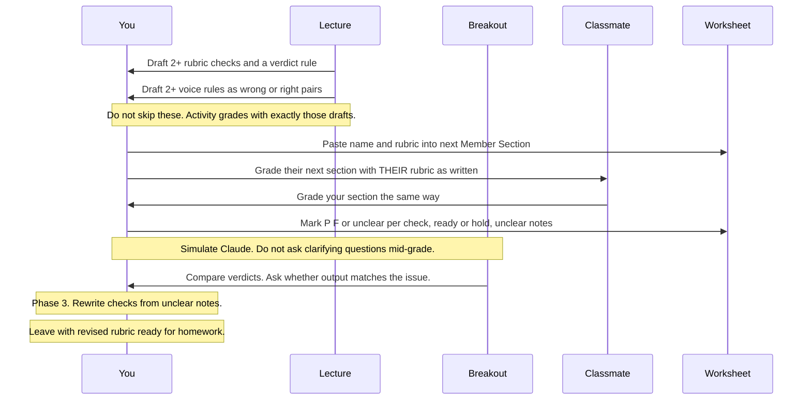
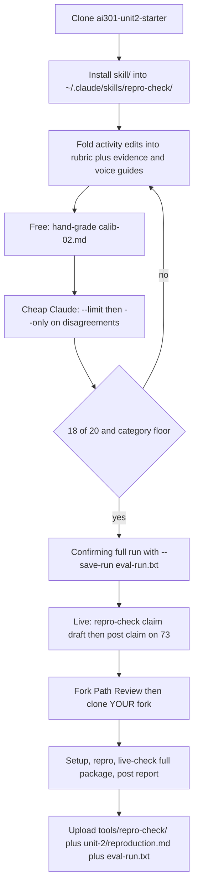

# Unit 2 session prep — Reproduce It / repro-check

Where this sits: notes under `beat-1-sandbox/unit-2/` in
[`speculaas/ai301-coursework-trilogy-preview`](https://github.com/speculaas/ai301-coursework-trilogy-preview).

Source: LMS Overview / Activity / Assignment dump at
`/Users/watney/git/zimmnotes/chat/codepath/ai301/beat-1-sandbox/unit-02/Overview-Activity-Assignment.txt`,
plus the L2 session dump `AI301-L2-Fa26-S1.txt` in this folder.

Starter clone (local):
`/Users/watney/git/zimmnotes/chat/codepath/ai301/beat-1-sandbox/unit-02/ai301-unit2-starter`
(`codepath/ai301-unit2-starter`).

## Timing

| | When (America/Denver) |
|---|---|
| **Live session** | Wed Sep 23, 2026 · 4:00 PM MDT |
| **Project 2 due** | Mon Sep 28, 2026 · 12:59 AM MDT |

Tomorrow is the **live session**, not the homework deadline. Leave class with a
draft rubric + voice rules that survived the swap. Homework (claim → fork →
repro → calibrate `repro-check`) comes after.

Chosen issue from Unit 1:
[#73](https://github.com/codepath/pathreview-ai301-fa26-s1/issues/73)
(README vs `.env.example` disagreement on the LLM provider env var —
`OPENROUTER_API_KEY` vs documented `mock`/`openai` + `OPENAI_API_KEY`). Not on
the house-issue track.

## What Unit 2 actually is

Two tracks in parallel:

1. **Human upstream:** claim #73 in your own words → fork Path Review → setup
   from repo docs → faithful repro (or honest cannot-repro) → post the report.
2. **Skill:** finish three judgment files inside `~/.claude/skills/repro-check/`
   — `rubric.md`, `references/evidence-guide.md`, `voice-guide.md` — then hit
   ≥18/20 on the harness (category floor matters; one disclosure-wall package
   cannot be papered over by volume).

Unit 1 withheld only the rubric. This week you write **three** files. Live
skill checks drafts before you post. Eval mode grades with rubric + evidence
guide only; the voice guide is live-only.

## Sequence — tomorrow's session (rubric swap)


```mermaid
sequenceDiagram
  participant You
  participant Lecture
  participant Breakout
  participant Classmate
  participant Worksheet

  Lecture->>You: Draft 2+ rubric checks and a verdict rule
  Lecture->>You: Draft 2+ voice rules as wrong or right pairs
  Note over You,Lecture: Do not skip these. Activity grades with exactly those drafts.

  You->>Worksheet: Paste name and rubric into next Member Section
  You->>Classmate: Grade their next section with THEIR rubric as written
  Classmate->>You: Grade your section the same way
  You->>Worksheet: Mark P F or unclear per check, ready or hold, unclear notes
  Note over You,Breakout: Simulate Claude. Do not ask clarifying questions mid-grade.

  Breakout->>You: Compare verdicts. Ask whether output matches the issue.
  Note over You: Phase 3. Rewrite checks from unclear notes.
  Note over You: Leave with revised rubric ready for homework.
```

Activity focus package: `eval/packages/calib-03.md` (in the starter).
Early finish: `calib-04.md`, or install the skill (Assignment step 1).

## Sequence — homework end-to-end (after class)


```mermaid
flowchart TD
  A[Clone ai301-unit2-starter] --> B["Install skill/ into ~/.claude/skills/repro-check/"]
  B --> C[Fold activity edits into rubric plus evidence and voice guides]
  C --> D["Free: hand-grade calib-02.md"]
  D --> E["Cheap Claude: --limit then --only on disagreements"]
  E --> F{"18 of 20 and category floor"}
  F -->|no| C
  F -->|yes| G["Confirming full run with --save-run eval-run.txt"]
  G --> H["Live: repro-check claim draft then post claim on 73"]
  H --> I[Fork Path Review then clone YOUR fork]
  I --> J[Setup, repro, live-check full package, post report]
  J --> K["Upload tools/repro-check/ plus unit-2/reproduction.md plus eval-run.txt"]
```

Assignment order (skim): steps 1–3 build/calibrate the skill; 4–6 use it on
the real issue; 7 submits. Claim **before** reproduce: promise the report, do
not assert a fix. Path Review house rules live in the skill's `scope.md`
(classmate claim does not block you; no piggyback "same as above").

### Install + eval commands (verified from starter)

```bash
# one canonical install (edit here; point harness at the same files)
cp -R skill/. ~/.claude/skills/repro-check/

cd eval
# free warm-up: open packages/calib-02.md and grade by hand

# cheap Claude smoke (still costs Sonnet; no local simulate script exists)
python3 run_eval.py \
  --rubric ~/.claude/skills/repro-check/rubric.md \
  --evidence ~/.claude/skills/repro-check/references/evidence-guide.md \
  --limit 3

# revise loop on disagreements only (~$0.20/pkg)
python3 run_eval.py \
  --rubric ~/.claude/skills/repro-check/rubric.md \
  --evidence ~/.claude/skills/repro-check/references/evidence-guide.md \
  --only pkg-07,pkg-12

# after loosening a check: add canaries (esp. disclosure) and/or calib with
# --include-calibration so a flip shows up before the confirming full run

# confirming full run for submit (only this writes eval-run.txt)
python3 run_eval.py \
  --rubric ~/.claude/skills/repro-check/rubric.md \
  --evidence ~/.claude/skills/repro-check/references/evidence-guide.md \
  --save-run eval-run.txt
```

## Token savings — verified against the starter (2026-09-23)

| Move | Cost | Unit 2 analogue |
|---|---|---|
| Hand-grade `calib-01`…`calib-04` | Free | Activity on `calib-03`; homework warm-up on `calib-02`; early-finish `calib-04` |
| Local Python smoke / `simulate_*.py` | n/a | **None in this starter.** `eval/` has `run_eval.py` + packages only. Every harness call uses Sonnet. |
| `--limit N` | ~$0.20 × N | Cheap Claude smoke after rubric + evidence are filled |
| `--only pkg-07,pkg-12` | ~$0.20 / package | Revise loop; compose with `--include-calibration` for calib canaries |
| Confirming full + `--save-run eval-run.txt` | ~$4 | Once, when you believe the three files |
| Live skill on drafts | Cheap vs re-posting | Required before claim and before repro comment |
| Canary on `--only` after loosening a check | Cheap insurance | Especially the 1-package `disclosure` category |

Same discipline as Unit 1 smoke → cheap Claude → confirming full, except Unit 2
has **no free simulator**. Tomorrow can stay at $0 with human `calib-*` grading;
install + `--limit` wait until after class.

Extra Unit 2 trap: `--limit` / `--only` runs **never** write `eval-run.txt`.
Never hand-edit that file. Full confirming run + `--save-run` only. Pass bar is
18/20 **and** the category floor (must match at least once in every category).

See also Unit 1 companion:
[`../unit-1/2026-09-21-smoke-vs-claude-eval.md`](../unit-1/2026-09-21-smoke-vs-claude-eval.md).

## Light checklist for 4 PM

1. Draft **two rubric checks + a ready/hold verdict rule** and **two voice
   rules** during lecture (they feed the activity).
2. Know #73 specifics for a later claim that **promises** a report, not a fix.
3. After class: install from the local starter into
   `~/.claude/skills/repro-check/`, then cheap `--limit` only after rubric +
   evidence are filled.
4. Do **not** claim upstream until live `repro-check` accepts the draft
   (Assignment step 4). Claiming is Unit 2 homework.

## What not to confuse

- **Tomorrow session** = draft + rubric swap practice (ungraded, huge head start).
- **Homework** = skill + eval + real claim/repro on #73, due Mon 9/28.
- **Submit portal** = whole `ai301-coursework` repo root URL, with
  `tools/repro-check/` + `beat-1-sandbox/unit-2/` filled (not a folder URL).

## Points (short)

Assignment worth 25: skill 8, eval run + write-up 10, posted comments 7.
Eval bar to aim at is 18/20 with category match; 18 itself scores no points —
the 10 eval points are the harness-written complete run (3) plus four
`reproduction.md` iteration fields (7). Comment points want a specific claim
and a stranger-rerunnable repro (honest cannot-repro is full credit).

## What an eval package is (2026-09-29)

Kept in this note (not a separate file): same flowchart + session prep, so the
definitions sit next to install/eval commands.

Each file under the starter’s `eval/packages/*.md` is a **frozen fake upstream
bundle**, not your live #73 work. Typical sections:

- repo facts (bug template, contribution / AI policy)
- issue text
- candidate claim comment
- candidate repro report

Kinds:

| Prefix | Role |
|---|---|
| `calib-01`…`calib-04` | Worksheet / free hand-grade practice; gold-labeled; `--include-calibration` can run them but they are **never scored** toward 18/20 |
| `pkg-01`…`pkg-20` | Scored harness set Claude grades with your rubric + evidence guide |

`eval/gold-labels.json` holds staff verdicts + categories (`clear-accept`,
`no-evidence`, `wrong-target`, `unfollowable-comms`, `disclosure`). Pass bar is
**18/20 and** at least one correct match in every category.

### Worksheet vs homework

- Live **rubric-swap worksheet** (Google Doc / local txt copy): ungraded activity.
  Not a portal upload.
- Flowchart node **“Fold activity edits into rubric plus evidence and voice
  guides”**: homework — rewrite the three skill files from Phase 3 notes, then
  calibrate.
- Claude’s job in `run_eval.py`: act as the **judge** applying *your* rubric +
  evidence guide to each package and scoring agreement with gold. It is not
  reproducing #73 for you.

### Hand-grade warm-up done (calib-02)

Using the installed skill rubric on `calib-02` (Joplin me-too, no evidence):

- Environment / Procedure / Artifact / Claim → **fail**
- Repo communication policy → **pass** (no AI disclosure required)
- **Verdict: reject** — matches gold (`category: no-evidence`)

### Install + exact `run_eval.py` commands (Mac, 2026-09-29)

Skill installed once from the local starter:

```bash
cp -R /Users/watney/git/zimmnotes/chat/codepath/ai301/beat-1-sandbox/unit-02/ai301-unit2-starter/skill/. \
  ~/.claude/skills/repro-check/
```

Verified tree: `SKILL.md`, `rubric.md`, `scope.md`, `voice-guide.md`,
`references/evidence-guide.md`.

Always `cd` into the starter’s `eval/` directory first:

```bash
cd /Users/watney/git/zimmnotes/chat/codepath/ai301/beat-1-sandbox/unit-02/ai301-unit2-starter/eval

# cheap smoke (~3 packages; does NOT write eval-run.txt)
python3 run_eval.py \
  --rubric ~/.claude/skills/repro-check/rubric.md \
  --evidence ~/.claude/skills/repro-check/references/evidence-guide.md \
  --limit 3

# revise only disagreements (example ids; replace after you see the smoke output)
python3 run_eval.py \
  --rubric ~/.claude/skills/repro-check/rubric.md \
  --evidence ~/.claude/skills/repro-check/references/evidence-guide.md \
  --only pkg-07,pkg-12

# optional: also grade calib-* while iterating (still never scored)
python3 run_eval.py \
  --rubric ~/.claude/skills/repro-check/rubric.md \
  --evidence ~/.claude/skills/repro-check/references/evidence-guide.md \
  --include-calibration \
  --limit 3

# confirming full run — ONLY this may write the submit log
python3 run_eval.py \
  --rubric ~/.claude/skills/repro-check/rubric.md \
  --evidence ~/.claude/skills/repro-check/references/evidence-guide.md \
  --save-run eval-run.txt
```

`--save-run` is refused on `--limit` / `--only` partial runs. Never hand-edit
`eval-run.txt`. After a good confirming run, copy that file into coursework
`beat-1-sandbox/unit-2/` (and web-upload `tools/repro-check/` as Unit 1).


## What `--rubric` and `--evidence` are (2026-09-29)

These two flags tell `run_eval.py` **which judgment files Claude must use** when
grading each eval package. They are paths on disk, not magic names.

```bash
--rubric ~/.claude/skills/repro-check/rubric.md
--evidence ~/.claude/skills/repro-check/references/evidence-guide.md
```

| Flag | File | What it does in the harness |
|---|---|---|
| `--rubric` | `rubric.md` | The **checks + verdict rule** (pass/fail/unclear → accept/reject). Eval mode grades with this. |
| `--evidence` | `references/evidence-guide.md` | How to **read artifacts** (what counts as proof, how to treat cannot-repro, wrong-target, etc.). Paired with the rubric in eval mode. |

**Why both point at `~/.claude/skills/repro-check/`**

- That directory is the **installed** skill (from `cp -R skill/. ~/.claude/skills/repro-check/`).
- Live `claude` sessions load the skill from there; the harness should grade with the **same** files so smoke/full runs match what live-check will do.
- If you edit only the starter’s `skill/` copy and forget to re-`cp`, Claude and `run_eval.py` can diverge. After rubric edits: copy again (or edit in place under `~/.claude/skills/repro-check/` and sync back into coursework `tools/repro-check/` for submit).

**What they are not**

- Not the eval packages themselves (`eval/packages/*.md`).
- Not `voice-guide.md` — voice is **live-only**; `run_eval.py` does not take a `--voice` flag.
- Not `eval-run.txt` — that is the **output** of a confirming full run (`--save-run`), not an input.

**Practical rule:** always pass the installed skill paths shown above unless you intentionally point at a WIP copy for an experiment.


## Inside `rubric.md` and `evidence-guide.md` (2026-09-29)

Canonical copies for grading live under the installed skill:

- `~/.claude/skills/repro-check/rubric.md`
- `~/.claude/skills/repro-check/references/evidence-guide.md`

(Starter originals: `ai301-unit2-starter/skill/…`. Re-`cp` after edits so harness and live Claude stay aligned.)

### `rubric.md` — the five required checks + verdict

Ask one question: **is this reproduction package ready to post?**

| Check | Pass when… | Common fail |
|---|---|---|
| **Environment is placed** | Report names version/commit, OS, install/build when relevant; material diffs from the issue are **stated**, not silent | Missing env; silent version/OS drift |
| **Procedure is independently followable** | A stranger can re-run *the candidate’s documented test* without private files or guesses; issue trigger preserved unless deviation is explicit; tiny syntax diffs can be material (`=` vs `:` in HCL) | Paraphrased commands; missing fixtures; unstated config |
| **Artifact proves the reported outcome** | Raw log/output/trace supports the claimed outcome; for a claimed repro, issue-defining signals match; cannot-repro needs a shown failed attempt + named material diffs | Vibes / “exactly reproduced”; graceful parse error ≠ panic |
| **Claim is specific and honest** | Names concrete behavior; does not overstate; promises only a next action under the author’s control | `+1!!`, invented root cause, guaranteed fix/deadline |
| **Repository communication policy** | Follows stated contribution / AI disclosure rules in the package; **no invented** disclosure requirement when none exists | Missing required AI disclosure |

**Verdict rule:** `accept` only if every required check is `pass`. Any `fail` or `unclear` → `reject`. Use `unclear` only when needed evidence is genuinely absent, not because the package is hard. Grade **proof**, not polish. Faithful cannot-repro can still `accept`.

### `evidence-guide.md` — where to look for that proof

Companion to the rubric: for each concern, **where it lives** (eval bundle vs live issue/draft) and **what good looks like**.

| Guide section | Maps mainly to |
|---|---|
| Environment | Environment is placed |
| Steps | Procedure is independently followable |
| Behavior shown | Artifact proves the reported outcome |
| Honesty | Claim is specific and honest |
| Comms | Repository communication policy |

Eval-mode rule at the top: the package is the **entire** evidence universe — do not fetch the live GitHub issue while grading harness packages.

Notable teaching points baked into the guide:

- Different env can still pass if stated and the attempt is faithful.
- Repeatability of the candidate’s test ≠ faithfulness to the issue (that’s the artifact check).
- Prefer raw artifacts over “confirmed.”
- Graceful HCL syntax error ≠ decoder panic (calib-03 lesson).
- Repeating a wrong test ten times ≠ relevance.

### How the two work together

`run_eval.py --rubric … --evidence …` hands **both** to Claude. The rubric names the gates; the evidence guide tells the model which blocks to read and how to compare signals. `voice-guide.md` is still live-only and not passed here.
