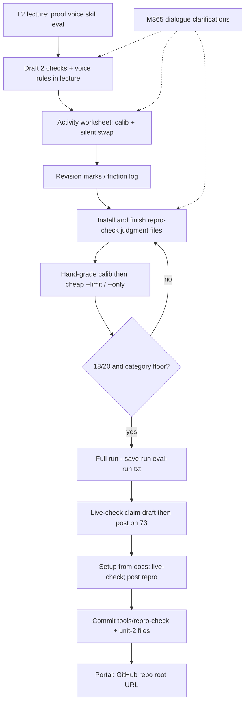
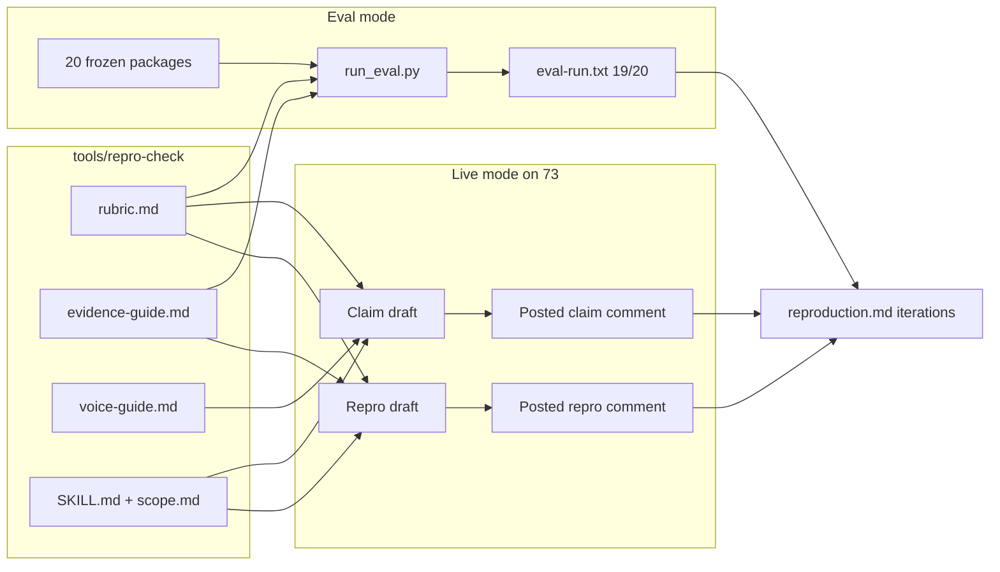

# Unit 2 map — L2 lecture + M365 dialogue → what we submitted

**Date:** 2026-09-29 (America/Denver)  
**Scope:** coach note only (trilogy-preview). Submit repo is separate:
[`speculaas/ai301-coursework`](https://github.com/speculaas/ai301-coursework).

| Source | Path on this Mac |
|---|---|
| L2 dump | `beat-1-sandbox/unit-2/AI301-L2-Fa26-S1.txt` (this folder) |
| M365 dialogue | `/Users/watney/Documents/embudo-dojo/docs/dialogue-dlg-m365-fa6d6f65-9turns-ai301-uni2-conti.json` (`dlg-m365-fa6d6f65`, 9 turns, exported 2026-09-27) |
| Session prep | `2026-09-23-unit2-session-prep.md` (this folder) |
| Submit repo | `/Users/watney/git/zimmnotes/chat/codepath/ai301/ai301-coursework` |

---

## 1. Purpose

Map **lecture concepts** and the **live-session M365 Copilot thread** onto the
artifacts and process that actually landed in the coursework repo / portal URL
(repo root). This is a correspondence note, not a transcript dump.

**Portal submit reminder (from L2 wrap-up):** graders open the course repo
link — `tools/repro-check/` plus `beat-1-sandbox/unit-2/{reproduction.md,eval-run.txt}`.
The live **worksheet** is activity-only; it is **not** a portal upload.

---

## 2. L2 lecture themes that matter for Unit 2

Grounded in `AI301-L2-Fa26-S1.txt` (session title: **Reproduce It**).

| Block (slide labels) | Theme (short paraphrase) | Why it shows up in homework |
|---|---|---|
| Roadmap / This Week You Ship | Unit 2 = reproduction phase + **`repro-check` skill**; continuity from Unit 1's selected issue | Issue #73 carried forward; skill folder is a graded deliverable |
| THE DELIVERABLE | Three student-written judgment files: `rubric.md`, `voice-guide.md`, `evidence-guide.md` (SKILL.md / scope.md staff-supplied) | Files under `tools/repro-check/` |
| LECTURE · PART 1 · Why proof | Maintainers triage on proof, not promises; burden of proof is the reporter's | Claim/repro comments must be evidence-first |
| Cold-open → THE REVEAL | Confident, polished "Confirmed!" report can still be worthless | Eval punishes format-grading; fidelity over polish |
| LECTURE · PART 2 · Real proof | Four proof parts: **environment**, **minimal steps**, **expected vs actual**, **artifact**; env record before repro | Structure of posted repro on #73; rubric checks map to these parts |
| Faithfulness grid | Honest cannot-repro can be ready; polished wrong-command report holds | `pkg-09` intentional miss; calib-03 wrong-target lesson |
| LECTURE · PART 3 · Your voice | Claim before repro work; name version/behavior + next artifact; house rule: classmate claim does not block you | Posted claim on #73; `voice-guide.md` |
| LECTURE · PART 4 · Your skill | Eval mode (20 frozen packages) vs live mode (drafts; `scope.md` gates posts) | `run_eval.py` → `eval-run.txt`; live-check before posting |
| THE EVAL | Bar ≥18/20 + **category floor**; revise cheap with `--only`; only full run writes submit log | Confirming run 19/20 PASS; disclosure category matched |
| THE SWAP / ACTIVITY | Compact rubric in worksheet member section; silent cold-run; unfinished revision marks → homework | Worksheet ≠ submit; activity edits fold into skill files |
| BEFORE YOU GO | Ship skill files + `reproduction.md` + `--save-run` `eval-run.txt`; **repo link is the submission** | Portal URL = coursework repo root |

---

## 3. M365 dialogue arc (`dlg-m365-fa6d6f65`, 9 turns)

Recorded during / just after the 2026-09-23 live session (turns ~16:32–18:13 MT).
Questions were poll recovery, voice/rubric drafting help, worksheet placement, and
homework continuation — not a second lecture.

| Turn | User ask (compressed) | What landed (compressed) |
|---|---|---|
| 0 | Recover crashed session; poll: when start the env record? | Start record when drafting the **claim** (before setup/repro). Claim promises investigation; repro states observed results. |
| 1 | Poll: which claim to assign? + AOSP/maintainer aside | Prefer claim that names **behavior + version + concrete scope**; "I can't reproduce" alone is not a claim. Maintainer ≠ job title. |
| 2 | Suggest voice rules; is this DevOps? | Two rules: (1) state only what evidence supports; (2) promise next **artifact**, not outcome/timeline. Not DevOps — collab SE / upstream voice. → draft for `voice-guide.md`. |
| 3 | 2 rubric checks + verdict from proof's four parts; skill vs plugin? | Outcome-based checks covering env/steps + expected/actual/artifact; verdict allows honest cannot-repro. Skill = artifact + practice; plugin often packages skills into a workflow. |
| 4 | Poll: skill run failed — next step? | **Update the package**, then re-run. Do not re-run unchanged or submit and hope. |
| 5 | Suggest rubric for the **activity** | Compact 2-check activity rubric (repeatable procedure + faithful artifact); classmate-applicable, not format-based. |
| 6 | Where does evidence guide go? (Member section 3) | **Not** in the worksheet. Worksheet gets checks + verdict only. Evidence guide lives in `tools/repro-check/` (skill folder). |
| 7 | Grade/fill worksheet + how continue homework? | Refuse inventing calib-03 grades without the package; clarify swap rotation (grade next member section, not own). Homework path: finish skill → eval → claim → repro → submit. |
| 8 | "can you work from here?" (starter dump available) | Honest calib-03 grade: Procedure P / Faithful F → **HOLD** (`=` vs `:` wrong target). Split **activity 2-check** vs **homework 5-check** rubric (incl. disclosure / repo-policy). Paste-ready skill files sketched. |

**Dialogue → artifact spine:** voice rules (T2) + activity checks (T3/T5) + cold-run
clarity on calib-03 (T8) → fuller five-check homework `rubric.md` + evidence/voice
guides → eval loop → live claim/repro on #73.

---

## 4. Correspondence table

| Lecture concept | Dialogue point | Submission artifact / process step |
|---|---|---|
| Proof's four parts (env, steps, expected/actual, artifact) | T3/T5 checks drafted from those parts | Posted repro comment on #73; Procedure / Artifact checks in `tools/repro-check/rubric.md` |
| Faithful beats polished; wrong-target holds | T8 calib-03: `=`→`:` → HOLD | Check rationale in `reproduction.md` cites calib-03; Procedure wording calls out one-char material diffs |
| Claim before setup/repro; promise artifact not fix | T0/T1 poll answers + T2 voice rules | Claim permalink `#issuecomment-5886021336`; body matches voice rules (no timeline/root-cause promise) |
| Classmate claim does not block you (`scope.md` / house rules) | — (also in session-prep) | Note in `reproduction.md` that `ocabezas95` already claimed; still posted own claim/repro |
| `voice-guide.md` as live gate | T2 suggested rules | `tools/repro-check/voice-guide.md` (evidence-only + next-artifact + no filler + disclose-when-required) |
| Eval mode: 20 packages, ≥18/20 + category floor | T8: activity rubric ≠ homework rubric; need disclosure check | `beat-1-sandbox/unit-2/eval-run.txt` — **19/20 PASS**; categories all matched; sole miss `pkg-09` |
| `--save-run` only on full run; iterations write-up | Session-prep / T7–T8 homework map | `reproduction.md` Eval iterations: run history, pkg-09 analysis, check rationale, trade-offs |
| Live mode: revise package then re-run skill | T4 poll: update package, don't blind re-run | Drafts live-checked before post (`claim-draft-issue-73.md` / trilogy repro draft) |
| Worksheet / operator swap is in-class | T6/T7: evidence guide not in member section; don't grade own section | Worksheet = activity-only (not portal). Edits folded into skill files for submit |
| Docs / repo reading before repro | Session continuity + #73 docs mismatch | Static docs repro at commit `f89c06f`: README vs `.env.example` vs `core/config.py` |
| Portal: course repo root URL | Wrap-up "repo link is the submission" | https://github.com/speculaas/ai301-coursework |

### What was actually submitted (verify on disk)

| Path in coursework repo | Role |
|---|---|
| `tools/repro-check/{SKILL.md,scope.md,rubric.md,voice-guide.md,references/evidence-guide.md}` | Skill judgment + staff contract |
| `beat-1-sandbox/unit-2/eval-run.txt` | Confirming Sonnet run, 19/20, fingerprints |
| `beat-1-sandbox/unit-2/reproduction.md` | Identity, claim/repro permalinks+bodies, eval iterations |
| `beat-1-sandbox/unit-2/claim-draft-issue-73.md` | Local draft aid (supporting; graded fields live in `reproduction.md`) |

Upstream:

- Claim: https://github.com/codepath/pathreview-ai301-fa26-s1/issues/73#issuecomment-5886021336
- Repro: https://github.com/codepath/pathreview-ai301-fa26-s1/issues/73#issuecomment-5886156672

---

## 5. Diagrams

### 5a. End-to-end Unit 2 pipeline



### 5b. Eval packages / rubric / evidence ↔ skill ↔ #73



### 5c. Dialogue clarifications feeding artifacts

```mermaid
sequenceDiagram
  participant You
  participant M365 as M365 Copilot
  participant WS as Worksheet activity
  participant Skill as repro-check files
  participant Up as Path Review 73
  participant Repo as ai301-coursework

  You->>M365: Polls + draft voice/rubric
  M365-->>You: Outcome-based checks; next-artifact voice
  You->>WS: Paste compact rubric; cold swap on calib-03
  WS-->>You: Friction: followable vs faithful target
  You->>M365: Where evidence guide? How continue homework?
  M365-->>You: Guide in skill folder; expand to 5 checks + disclosure
  You->>Skill: Write rubric evidence voice; run eval
  Skill-->>You: 19/20; keep pkg-09 miss
  You->>Up: Live-checked claim then repro
  You->>Repo: Commit skill + eval-run + reproduction.md
```

---

## 6. Gaps / caveats

- Suggested Documents path `.../Documents/ai301-coursework-trilogy-preview/...` does **not** exist on this Mac; real trilogy-preview is under `~/git/zimmnotes/chat/codepath/ai301/ai301-coursework-trilogy-preview/`.
- Trilogy-preview copies of `eval-run.txt` / `reproduction.md` are still **starter stubs**; the filled submit copies live only in `ai301-coursework/` (do not treat preview stubs as the graded artifacts).
- Dialogue T7 correctly refused fabricate calib-03 grades until T8 had the starter package — worksheet grades themselves were never a portal artifact.
- Exact portal LMS click-path was not re-verified in this note; lecture + session-prep agree the **submission is the coursework repo root URL**.

---

## Related local notes

- `2026-09-23-unit2-session-prep.md` — timing, install/eval commands, pkg-09 do-not-loosen
- `2026-09-29-claim-draft-issue-73.md` / `2026-09-29-repro-draft-issue-73.md` — non-submit drafts
