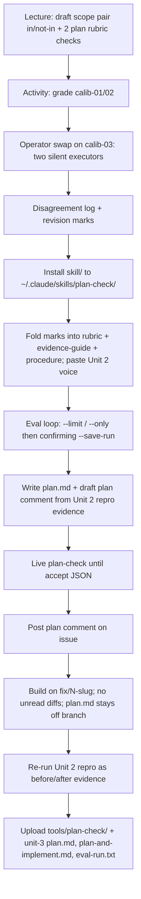

# Unit 3 session prep — Plan the Fix / plan-check

Where this sits: notes under `beat-1-sandbox/unit-3/` in
[`speculaas/ai301-coursework-trilogy-preview`](https://github.com/speculaas/ai301-coursework-trilogy-preview).

**Scope:** coach / preview note only. Portal submit is the separate coursework
repo root ([`speculaas/ai301-coursework`](https://github.com/speculaas/ai301-coursework)),
same pattern as Unit 2 — graders want the whole repo URL, not a folder URL.

## Source table

| Source | Path |
|---|---|
| LMS Overview / Activity / Assignment dump | `Overview-Activity-Assignment.txt` (this folder; also under `~/git/zimmnotes/chat/codepath/ai301/beat-1-sandbox/unit-03/`) |
| L3 session dump | `AI301-L3-Fa26-S1.txt` (this folder; original name `AI301 L3 · Fa26 S1.txt`) |
| Plan calibration worksheet (canonical md) | `plan_worksheet.md` (this folder) — **Google Doc / sheet link TBD** (instructor posts template link in chat at activity start) |
| Unit 3 starter (local clone) | `/Users/watney/git/zimmnotes/chat/codepath/ai301/beat-1-sandbox/unit-03/ai301-unit3-starter` (`codepath/ai301-unit3-starter`) |
| Unit 2 session prep (template / continuity) | [`../unit-2/2026-09-23-unit2-session-prep.md`](../unit-2/2026-09-23-unit2-session-prep.md) |
| Unit 2 lecture→submit map | [`../unit-2/2026-09-29-unit2-lecture-dialogue-submit-map.md`](../unit-2/2026-09-29-unit2-lecture-dialogue-submit-map.md) |

Coursework placeholders already in this folder (not filled for Unit 3 yet):
`plan.md`, `plan-and-implement.md`, `eval-run.txt`.

## Timing

| | When (America/Denver) |
|---|---|
| **Live session** | Wed Sep 30, 2026 · 4:00 PM MDT |
| **Project 3 due** | Mon Oct 5, 2026 · 12:59 AM MDT |

Tomorrow is the **live session**, not the homework deadline. Leave class with
revision marks (and friction → rubric vs procedure routes) from the operator
swap. The **build** is homework by design: activity needs no local setup.

Continuity from Unit 2: claimed + reproduced issue
[#73](https://github.com/codepath/pathreview-ai301-fa26-s1/issues/73)
(or house-issue track + TF setup if repro did not land — Overview says nothing
this week depends on last week's miss).

## Purpose / what Unit 3 ships

Arc midpoint. Banner line from L3 / Overview: **write the plan before you write
the code.** Walk in with Unit 2 proof; walk out with:

1. **Skill `plan-check`** — three authored components:
   - `rubric.md` (plan ready/hold checks + verdict rule)
   - `references/evidence-guide.md` (where evidence lives in a plan package)
   - **`procedure.md` (new)** — the skill's own grading steps (read order,
     evidence gathering, check execution, verdict assembly). `SKILL.md` now
     says: execute `procedure.md`.
   - `voice-guide.md` — **carry over** from Unit 2 (paste into labeled slot;
     extend only if plan-comment register needs new rules; not re-authored as
     new graded work).
2. **Plan + build for your issue** — `plan.md` in the **course repo** (never on
   the branch), plan comment posted upstream, change built on
   `fix/<issue-number>-<slug>` of **your** fork, Unit 2 repro steps re-run as
   the before/after test.

Points (Assignment short form, 25 total): skill **8**, eval run + write-up
**10**, plan and build **7**. Eval bar to aim at is **18/20 + category floor**
(no points attached to 18 itself). Category with teeth this week:
**thread-and-convention** (2 packages) — a rubric with no comms checks cannot
buy those misses back on volume.

## Lecture L3 themes that matter for homework

Grounded in `AI301-L3-Fa26-S1.txt` (session: **Plan & Build / Fix It**).
Authoritative activity steps live on the **Activity tab** in
`Overview-Activity-Assignment.txt` (worksheet is blanks only).

| Block | Theme (paraphrase) | Why it shows up in homework |
|---|---|---|
| Roadmap | Unit 3 = plan-and-build + **`plan-check`**; Unit 4 turns the branch into the sandbox PR | Branch naming + `plan.md` deviations feed Unit 4 |
| Why plan first | Maintainer review capacity is scarce; code-first PRs get closed | Plan comment before build |
| Root cause vs symptom | Diagnosis must follow from **posted Unit 2 repro**; patching the surface = wrong-cause | Grounding checks; eval punishes diagnosis that contradicts repro-evidence |
| Six parts of `plan.md` | diagnosis, **scope pair (in / not-in)**, files, approach, test plan, risks | Homework step 4 plan content; lecture drafts the scope pair live |
| Scope creep | Bounded plan vs while-I'm-here redesign; **not-in** is the fence | Scope-creep category in eval |
| Decisive test | Before = Unit 2 repro failing; after = same steps with **expected output stated first** | Evidence block in `plan-and-implement.md` |
| Plan comment | Read the thread; promise only what the plan contains; engage maintainer signals | Posted comment + paste under link for grading |
| You drive, AI operates | One bounded step → diff → accept/redo; **no diff lands unread** | Build loop; deviation → update `plan.md`, re-run live plan-check, update thread if intent changed |
| `procedure.md` | Four empty stage headings you fill; Claude cannot ask mid-grade | New authored component; operator-swap friction routes here |
| Eval | Same 18/20 bar; categories include clear accepts (incl. honest scoped-down), scope creep, wrong cause, unbuildable, thread+convention | `--only` revise + canaries when loosening; `--save-run` only on full run |

Failure families named for drafting checks (Activity / rubric template): diagnosis
vs repro evidence, one bounded change, stranger-executable, observable test
outcome, honest unknowns, comment respects thread + repo conventions.

## Plan worksheet role

- **Canonical local copy:** `plan_worksheet.md` in this folder (fill-in blanks;
  every instruction is on the Activity tab / `activity_3.md` in the course repo).
- **Live form:** Google Doc the instructor links in chat — **File → Make a copy**.
  Work in copies, never the template. Personal copy = phases 1 + 4; group copy =
  phases 2, 3, 5.
- **Not a portal upload.** Revision marks fold into skill files for homework.
- **Google sheet / Doc URL:** not captured yet (TBD when chat link lands).

Operator swap (Unit 2 rubric swap, round two): two executors run your rubric
silently; every friction line gets a **route** — rubric gap → `rubric.md`,
procedure gap → `procedure.md`. Package for swap: `eval/packages/calib-03.md`
(phase 1 grades `calib-01` / `calib-02`).

## Sequence — tomorrow's session → homework



### Install + eval commands (from starter README / eval README)

```bash
# clone if needed, then one canonical install
cp -R /Users/watney/git/zimmnotes/chat/codepath/ai301/beat-1-sandbox/unit-03/ai301-unit3-starter/skill/. \
  ~/.claude/skills/plan-check/

cd /Users/watney/git/zimmnotes/chat/codepath/ai301/beat-1-sandbox/unit-03/ai301-unit3-starter/eval

# cheap smoke (does NOT write eval-run.txt)
python3 run_eval.py \
  --rubric ~/.claude/skills/plan-check/rubric.md \
  --evidence ~/.claude/skills/plan-check/references/evidence-guide.md \
  --limit 3
# procedure.md is picked up next to the rubric by default

# revise disagreements only (~$0.20/pkg); add canaries if you loosen a check
python3 run_eval.py \
  --rubric ~/.claude/skills/plan-check/rubric.md \
  --evidence ~/.claude/skills/plan-check/references/evidence-guide.md \
  --only pkg-07,pkg-12

# confirming full run — ONLY this may write the submit log (~$4)
python3 run_eval.py \
  --rubric ~/.claude/skills/plan-check/rubric.md \
  --evidence ~/.claude/skills/plan-check/references/evidence-guide.md \
  --save-run eval-run.txt
```

Live check before posting (Assignment homework order):

```bash
# from the folder holding your drafts
claude "plan-check: grade my plan in plan.md and draft comment in comment.md for issue <URL>"
```

Expect per-check summary + fenced JSON `accept`/`reject`. Scope-message stop =
skill ran but installed `scope.md` still has the staff placeholder — get cohort
scope from instructor, drop in, re-run. Neither JSON nor scope stop = skill did
not run.

## Light checklist for 4 PM (Wed Sep 30)

1. Draft **scope pair (in / not-in)** for your own plan and **two rubric checks**
   during lecture (Activity grades with those drafts).
2. Know where Unit 2 repro evidence lives for #73 (or house repro pack quotes).
3. After class: install into `~/.claude/skills/plan-check/`, finish three
   components + voice carry-over, then cheap `--limit` only after they are filled.
4. Live `plan-check` **before** posting the plan comment; keep `plan.md` out of
   branch commits; name branch `fix/<issue-number>-<slug>`.

## What not to confuse

- **Tomorrow session** = draft + operator-swap calibration (ungraded head start).
- **Homework** = skill + eval + plan.md + posted comment + branch build + submit.
- **`plan.md`** lives in coursework `beat-1-sandbox/unit-3/`, **never** on the
  fix branch (becomes a PR a maintainer reads in Unit 4).
- **Worksheet** = activity only; not a portal upload.
- **Submit portal** = whole `ai301-coursework` repo root URL, with
  `tools/plan-check/` + `beat-1-sandbox/unit-3/` filled.

## Open questions / gaps

- **Google Doc / sheet link** for the live plan worksheet: not in sources yet
  (instructor links in chat at activity start). Local `plan_worksheet.md` is the
  canonical blank structure only.
- **Cohort `scope.md`** for Path Review: starter still ships staff placeholder;
  live mode may stop with a scope message until instructor file is dropped in.
- **House-issue track:** only if #73 path is blocked; TF sets up in room —
  confirm at session if needed.
- Lecture dump's breakout slide mentions a sample rubric for Phase 1; **Activity
  tab** (authoritative) says grade with **your lecture drafts**. Prefer Activity
  tab wording if they diverge.
- Branch contents are **not** graded this week; Unit 4 reads the PR diff against
  `plan.md`.

## Related

- Unit 2 session prep (install/eval/claim discipline this note mirrors):
  [`../unit-2/2026-09-23-unit2-session-prep.md`](../unit-2/2026-09-23-unit2-session-prep.md)
- Unit 2 lecture / dialogue → submit map:
  [`../unit-2/2026-09-29-unit2-lecture-dialogue-submit-map.md`](../unit-2/2026-09-29-unit2-lecture-dialogue-submit-map.md)
