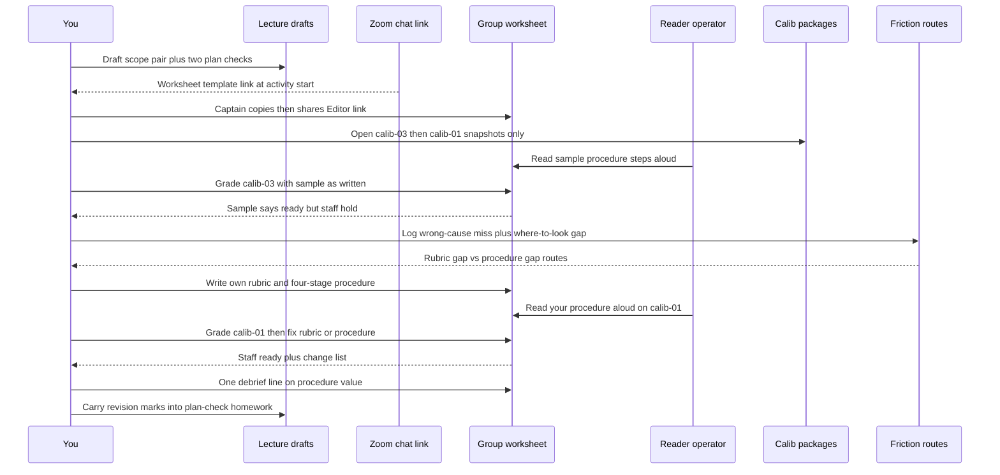

# Unit 3 activity today — Teach Claude to Grade a Plan

**Date:** Wed Sep 30, 2026 (America/Denver) · live session 4:00 PM MDT  
**Scope:** coach / preview note only (`beat-1-sandbox/unit-3/` in
[`speculaas/ai301-coursework-trilogy-preview`](https://github.com/speculaas/ai301-coursework-trilogy-preview)).  
**User:** Yie Sheng Chen / GitHub `speculaas` · continuity Path Review issue 73
(README vs `.env.example` OPENROUTER_API_KEY docs mismatch).

## Source table

| Source | Path |
|---|---|
| Downloaded live worksheet (authoritative blanks for today) | `Copy-of-Unit-3-Activity-Worksheet.txt` (this folder; from `docs/Copy of Unit 3 Activity Worksheet.txt`) |
| L3 dump activity slides | `AI301-L3-Fa26-S1.txt` — breakout: one group Doc, sample rubric/procedure in Phase 1 |
| Overview Activity tab (older swap protocol still printed) | `Overview-Activity-Assignment.txt` Activity section |
| Older blank structure (member sections / operator swap) | `plan_worksheet.md` — **not** the Doc shape for tonight |
| Session prep | `2026-09-29-unit3-session-prep.md` |
| Unit 3 calib packages (local starter) | `/Users/watney/git/zimmnotes/chat/codepath/ai301/beat-1-sandbox/unit-03/ai301-unit3-starter/eval/packages/` |
| Unit 2 sequence style reference | [`../unit-2/2026-09-29-unit2-lecture-dialogue-submit-map.md`](../unit-2/2026-09-29-unit2-lecture-dialogue-submit-map.md) §5c |

### Worksheet conflict (read this once)

- **Tonight's live Doc** matches the downloaded worksheet + L3 breakout:
  one captain copy, whole group in that Doc, Phase 1 uses the **sample**
  rubric/procedure on **calib-03**, then write your own, then test on
  **calib-01**.
- **Overview Activity tab** + **`plan_worksheet.md`** still describe the Unit 2
  style personal+group copies, Phase 1 on calib-01/02 with *your* lecture
  drafts, and member-section operator swap on calib-03.
- Prefer the **downloaded worksheet + L3 activity slides** for what you type
  in the room. Keep Overview/`plan_worksheet.md` as homework/skill context
  (friction still routes rubric vs procedure; member-section swap may return
  if staff reverts the Doc).

**Google Doc URL:** do not invent. Captain opens the chat link at activity
start → File → Make a copy → Share Anyone-with-link Editor → paste link in
Zoom chat.

---

## DURING the live activity — ordered checklist

1. **Before rooms / lecture drafting moments**
   - Keep lecture drafts ready (scope pair for issue 73 + two plan-check
     checks) even though Phase 1 grades with the **sample** — they seed
     homework `plan.md` and your Phase 2 rubric.
   - Know where calib packages live locally (open from Activity tab /
     starter `eval/packages/`). Do **not** open the live upstream issue pages;
     grade the snapshot only.
2. **Setup (~5 min)**
   - Open the worksheet template link from Zoom chat (listen for it; URL not
     in sources).
   - Captain: Make a copy → Share Editor → paste link → share screen.
   - Everyone else: open the shared copy (if you cannot type, you are in the
     template).
   - Fill Group Name + Date (today: 2026-09-30).
   - Open **calib-03** and **calib-01** from the Activity tab / starter packages.
3. **Phase 1 · grade with the sample · calib-03 · ~10 min**
   - Pick a **reader/operator**: one person reads each sample-procedure step
     aloud; the group does **only** what that step says (Claude cannot ask).
   - Rotate the reader each phase if useful (light cold-execute rotation;
     tonight is one Doc, not member-section Executor 1/2 blocks).
   - Fill grades → verdict → compare-with-correct (staff: **hold**) → what was
     unclear → where we didn't know where to look.
4. **Phase 2 · write your own · ~15 min**
   - Fix every Phase 1 miss, starting with the check that let the **wrong
     cause** through.
   - Each check: what / where in the file / pass condition / required or
     preferred. Verdict rule must say what `?` does.
   - Procedure: four stages (read first → gather evidence → grade → verdict).
5. **Phase 3 · test and fix · calib-01 · ~15 min**
   - Same cold-execute discipline on **your** procedure against calib-01.
   - Staff correct verdict: **ready**. If you held, name the rejecting check.
   - Last 5 min: edit Our rubric / Our procedure above; list changes.
6. **Phase 4 · debrief · ~5 min**
   - One group answer: what would Claude have gotten wrong without your
     procedure?
7. **Finished early**
   - Optional calib-04 (either verdict defensible). Then homework step 1 on
     Assignment tab — do **not** start a confirming `--save-run` in the room.
8. **Friction → route (still true tonight)**
   - Ambiguous pass condition → **rubric** mark.
   - No where-to-look / read order → **procedure** mark.
   - Missing what-good-looks-like for a package field → **evidence guide**
     (homework; not a worksheet box tonight).
9. **What NOT to do**
   - Do not invent or chase a Google Doc URL before chat posts it.
   - Do not grade from the live GitHub issue (snapshot only).
   - Do not “help” the sample by grading what you *meant*; execute as written.
   - Do not treat the worksheet as a portal upload.
   - Do not push branches / post plan comments during the activity.
   - Do not hand-edit a future `eval-run.txt`.

---

## DRAFT — paste-ready worksheet fills (user / group)

Label: **DRAFT**. Paste into the shared Doc; revise live when the room
disagrees. Grounded in starter `calib-03.md` / `calib-01.md` + L3 collision
example + issue 73 continuity. Tonight has **no member sections** — the whole
group owns every box. If staff switches back to `plan_worksheet.md` member
sections mid-session, paste the Phase 2 rubric block into **your** claimed
Member Section as "if you own this section" and leave Executor grades blank
until you cold-run someone else's section.

### Header

```
Group Name: DRAFT — OpenRouter Speculaas (or whatever the room picks)
Date: 2026-09-30
```

### Phase 1 — Grades for calib-03 (sample rubric, executed literally)

Sample checks (already on the worksheet — do not rewrite them in Phase 1):

- diagnosis (required): passes if the plan says what causes the bug.
- scope (required): names each file it will change and what it will not touch.
- test (required): passes if the plan adds an automated test.
- Verdict rule: ready if every required check passes.

**DRAFT grades (literal sample pass conditions):**

```
diagnosis — P — plan states a cause: HashedEventRegister in src/output.rs drops default minus bindings so shift+G walks the buffer
scope — P — In: binding registration in src/output.rs. Not in: syntax highlighting pipeline
test — P — plan adds a pager-integration smoke test asserting the default binding set is registered
```

**DRAFT Verdict (under the sample rule):**

```
ready
```

(Staff correct verdict is **hold**. The sample wrongly yields ready — that is
the Phase 1 lesson.)

**DRAFT Compare with the correct verdict (hold):**

```
Plan diagnosis blames pager key-binding registration. Repro evidence shows the
wait tracks highlighting, not navigation: bat --color=never reaches EOF in
under 0.3s in the same pager, and bat --color=always --paging=never still takes
~25.8s with no pager. Sample diagnosis only asks whether a cause is stated, not
whether it follows from repro-evidence, so the wrong cause passes. Scope and
test also pass on polish while the grounding collision is never checked.
```

**DRAFT What was unclear:**

```
diagnosis — "says what causes the bug" does not say the cause must be reachable
from the Repro evidence block, so we could not tell P vs F without guessing
intent
```

**DRAFT Where we didn’t know where to look:**

```
sample procedure step 2 ("Find the evidence for each check") never names the
Repro evidence block or the Diagnosis line as the compare pair
```

### Phase 2 — Our rubric (DRAFT)

```
diagnosis-grounded (required): look in Candidate plan Diagnosis next to Repro evidence Expected/Actual and Steps; passes if the stated cause is reachable from that repro (no contradiction with timings or toggles the repro already ran).
scope-pair (required): look in Scope / Changes; passes if it names the files or areas it will change AND what it will not touch.
test-observable (required): look in Test plan; passes if it names an observable before/after outcome tied to the repro steps (automated test preferred, but a stranger-runnable manual check with the expected-after stated still passes).
comment-faithful (preferred): look in Candidate plan comment; passes if it promises only what the plan contains and engages thread or repo-policy signals when present.
Verdict rule: ready only if every required check is P; F or ? on a required check means hold; preferred checks never change the verdict.
```

### Phase 2 — Our procedure (DRAFT)

```
1. What to read first
Read in order: Issue / thread highlights, then Repro evidence, then Candidate plan (Summary, Diagnosis, Scope, Changes, Test plan), then Candidate plan comment. Do not open the live upstream issue.

2. How to gather the evidence
From Repro evidence pull Expected, Actual, and any toggle timings. From Diagnosis pull the cause sentence. From Scope/Changes pull in-scope files and not-in lines. From Test plan pull the observable outcome. From the comment pull promises and any maintainer or policy nods. Put Diagnosis beside Repro Actual for a side-by-side compare.

3. How to grade each check
For each rubric check, apply its pass condition to the gathered quotes only. Write P, F, or ?. If the package lacks the field the check needs, write ? and one line naming the missing field. Do not invent facts from outside the package.

4. How to reach the verdict
Apply the verdict rule: any required F or ? → hold; else ready. Preferred fails are noted but do not flip the verdict. Quote the deciding check's evidence line next to the verdict.
```

### Phase 3 — Grades for calib-01 (using OUR rubric above)

**DRAFT grades:**

```
diagnosis-grounded — P — cause is missing post-push refresh of branch-commits view model; matches repro where color flips only after Esc and re-entry while remote already updated
scope-pair — P — In: push completion callback in pkg/gui/controllers/sync_controller.go adds commits context to post-push refresh. Out: how push status is computed, and other views' refresh behavior
test-observable — P — re-run repro steps; at step 3 color must flip without leaving the view; also check main commits panel and force push sharing the callback
comment-faithful — P (preferred) — promises the one-change sync-controller fix and nods at CONTRIBUTING review-bandwidth note
```

**DRAFT Verdict:**

```
ready
```

(Staff correct verdict is **ready**. If the room held, the rejecting check is
probably over-tight — e.g. demanding an automated test when the plan's manual
observable is enough under `test-observable`.)

**DRAFT Compare with the correct verdict:**

```
Correct is ready. Our required checks all P. If a prior draft said hold for
"no automated test", that check was asking for the wrong thing relative to
calib-01's stranger-runnable manual expected-after.
```

**DRAFT What we changed (after Phase 3 fix pass):**

```
rubric — diagnosis-grounded: require Diagnosis vs Repro evidence compare, not merely "a cause is stated"
rubric — test-observable: allow manual expected-after tied to repro; do not require automated-only
procedure — stage 1: fixed read order including Repro evidence before plan
procedure — stage 2: explicit Diagnosis-beside-Actual gather step
```

### Phase 4 — Debrief (DRAFT one-liner)

```
Without our procedure Claude would grade Diagnosis as soon as a cause sentence
exists and never open Repro evidence first, so calib-03's wrong-cause plan would
look ready the same way the sample did.
```

### Finished early — calib-04 (structure only)

**HOLD — package not pasted into this note's grade lines.** Local file exists at
starter `eval/packages/calib-04.md`. If the room opens it:

```
Verdict: (room decides — either side defensible)
Check that would flip it: (name the required check whose pass condition is the hinge)
```

Do not invent calib-04 evidence here.

---

## Lecture drafts to walk in with (not worksheet boxes, seed homework)

### Scope pair for Path Review issue 73 (DRAFT)

```
In scope: align .env.example with README Quick Start by documenting
OPENROUTER_API_KEY (and clarifying LLM_PROVIDER options so openrouter is not
invisible next to mock/openai); keep the change docs/example-env only unless
a one-line comment fix in README is required for the same mismatch.
Not in scope: changing core/config.py field defaults or OpenRouter base URL /
model defaults, OpenAI key behavior, mock provider logic, UI, or unrelated
docs refactors.
```

Grounded in posted repro at commit `f89c06f`: README asks for OPENROUTER_API_KEY;
`.env.example` only shows `LLM_PROVIDER=mock` and `OPENAI_API_KEY`;
`core/config.py` already defines both key fields.

### Two compact plan-check checks (DRAFT — fold into Phase 2 if sample is thin)

```
diagnosis-grounded (required): Diagnosis must follow from the package Repro evidence block.
scope-pair (required): Plan names what it will change and what it will not touch.
```

---

## Activity flow — sequence diagram

GitHub-safe Mermaid: no `;` `?` `#` in message text.



---

## After class (pointer only — full order on Assignment tab)

1. Install `skill/` → `~/.claude/skills/plan-check/`.
2. Fold tonight's marks into `rubric.md`, `references/evidence-guide.md`,
   `procedure.md`; paste Unit 2 `voice-guide.md`.
3. Cheap `--limit` / `--only`, then confirming `--save-run` only.
4. Write `plan.md` from issue 73 repro evidence + scope pair above; live
   plan-check before posting; build on `fix/73-<slug>`; keep `plan.md` off
   the branch.

---

## Related

- Session prep (timing, install/eval, open questions):
  [`2026-09-29-unit3-session-prep.md`](2026-09-29-unit3-session-prep.md)
- Unit 2 dialogue sequence style:
  [`../unit-2/2026-09-29-unit2-lecture-dialogue-submit-map.md`](../unit-2/2026-09-29-unit2-lecture-dialogue-submit-map.md)
